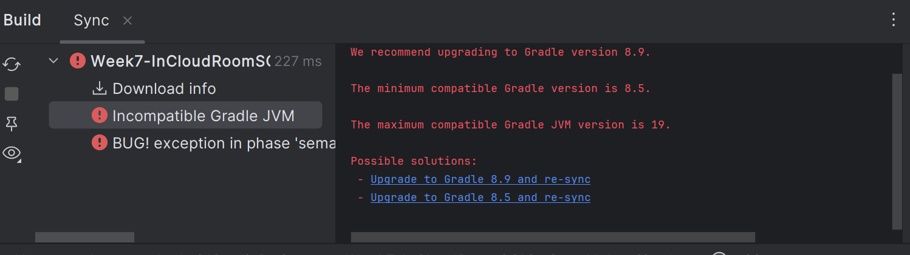

#How to clone a github repo

This is useful in downloading any public or private (if accessible) github project (code) to your local device to explore, update or study the code.

Using Android Studio:
1. File New -> Project from version control...

  

2. Provide your github repo url

  

3. Upgrade gradle if required.

  

4. Sync Gradle.

  

